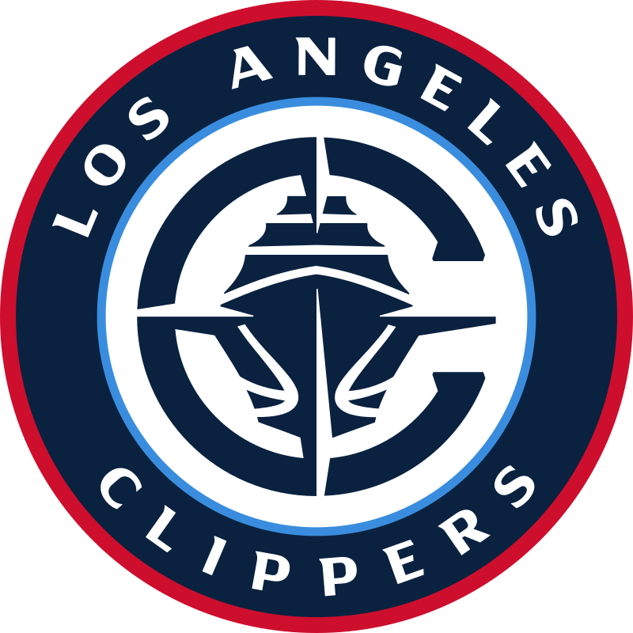

  

<h1 align="center">🏀 LA Clippers Fan Website</h1>

  A sleek and dynamic React + TypeScript website for showcasing the Los Angeles Clippers roster, schedule, and stats using live NBA APIs.

---

## 🚀 Features

- ⚛️ Built with **React + TypeScript**
- 🏀 Live **Los Angeles Clippers roster** pulled from `nba_api` via FastAPI backend
- 🔀 Client-side routing with **React Router** (`/`, `/roster`, `/schedule`)
- 📸 Headshots, sortable roster table, height parsing, rookie handling, and contract data
- 🎨 Clippers-themed layout using clean CSS (no Tailwind)
- 🌐 Easily extensible to show **stats**, **news**, or **game results**

